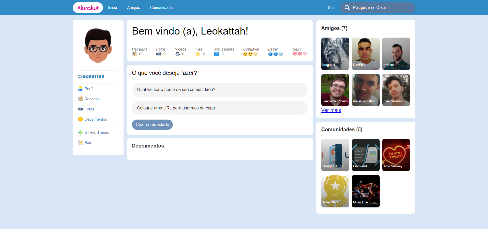

<h1 align="center"> 
# Alurakut ✨

Projeto desenvolvido durante a 3ª edição da Imersão React promovida pela [Alura](https://www.alura.com.br/).
</h1>

</p>
<h1 align="center">
    
</h1>


<p align="center">
 <a href="#-sobre-o-projeto">Sobre</a> •
 <a href="#-funcionalidades">Funcionalidades</a> •
 <a href="#-layout">Layout</a> • 
 <a href="#-como-executar-o-projeto">Como executar</a> • 
 <a href="#-tecnologias">Tecnologias</a> • 
 <a href="#-autor">Autor</a> • 
 <a href="#user-content--licença">Licença</a>
</p>


## 💻 Sobre o projeto

A aplicação foi desenvolvida em uma semana de muita prática e contribuições no Discord. Os professores deram um show de conhecimento e didática. 

---

## ⚙️ Funcionalidades

...
---

## 🎨 Layout

O layout da aplicação está disponível no Figma:

<a href="https://www.figma.com/file/EPPNOHAfWdvMWfjsHPLAIj/Alurakut?node-id=58%3A0">
  
</a>


### Web

<p align="center" style="display: flex; align-items: flex-start; justify-content: center;">
  

</p>

---

## 🚀 Como executar o projeto
### Pré-requisitos

Antes de começar, você vai precisar ter instalado em sua máquina as seguintes ferramentas:
[Git](https://git-scm.com), [Node.js](https://nodejs.org/en/). 
Além disto é bom ter um editor para trabalhar com o código como [VSCode](https://code.visualstudio.com/)

#### 🧭 Rodando a aplicação web (Frontend)

```bash

# Clone este repositório
$ gh repo clone leokattah/alurakut

# Acesse a pasta do projeto no seu terminal/cmd
$ cd letmeask

# Instale as dependências
$ yarn install
# ou npm install

# Execute a aplicação em modo de desenvolvimento
$ yarn dev
# ou npm run start

# A aplicação será aberta na porta:3000 - acesse http://localhost:3000

```

 Quer ver a aplicação no seu navegador? https://alurakut-rho-livid.vercel.app/


---

## 💻 Tecnologias
 - [React](https://reactjs.org)
 - [Next.JS](https://nextjs.org/)
 - [styled-components](https://styled-components.com/)

## Autor
	
[Website com o portfólio](https://alurakut-rho-livid.vercel.app/)

 
---

## 📝 Licença

Este projeto esta sobe a licença [MIT](./LICENSE).

Feito com ❤️ por Leonardo Kattah 👋🏽 [Entre em contato!](https://www.linkedin.com/in/leonardo-kattah-55059a20/)
